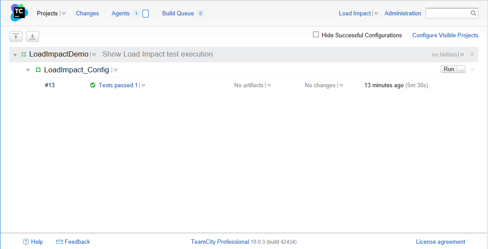
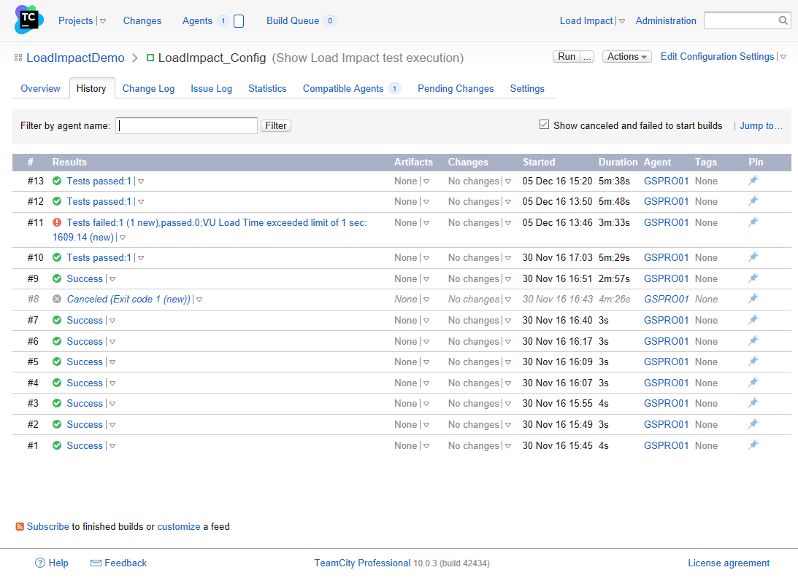
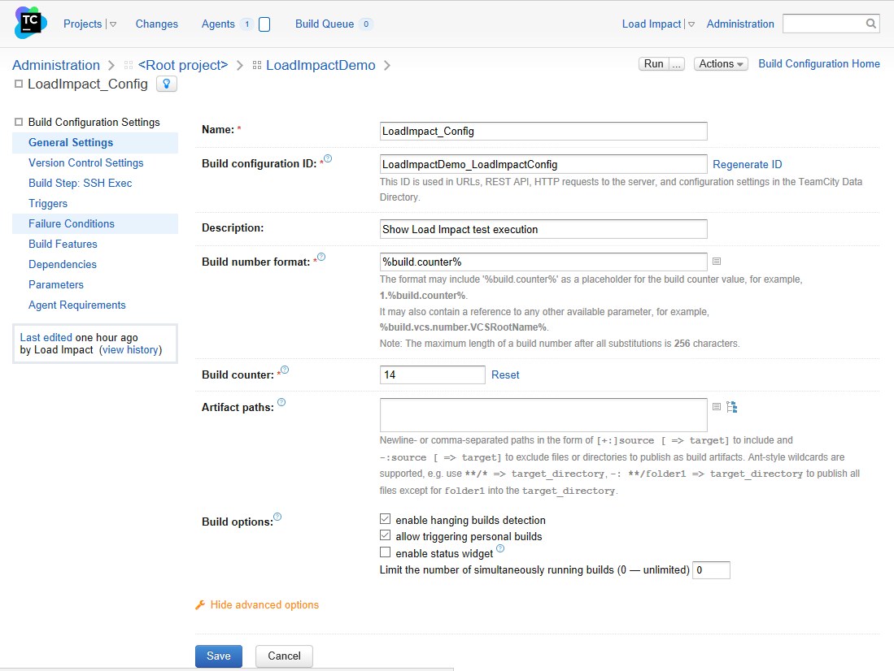
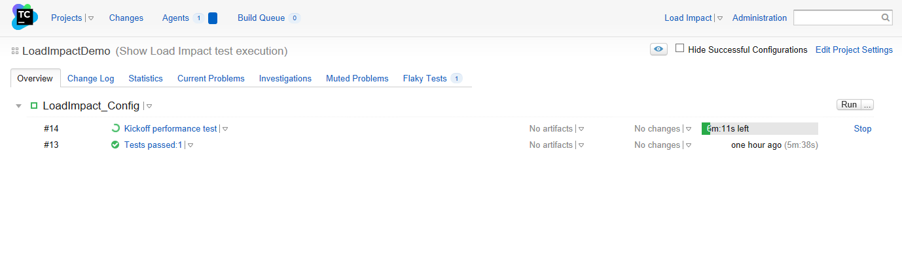
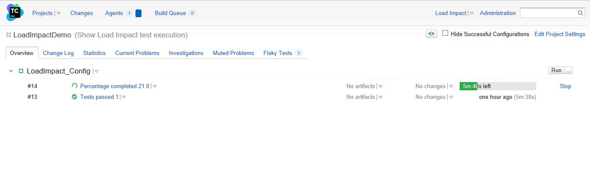
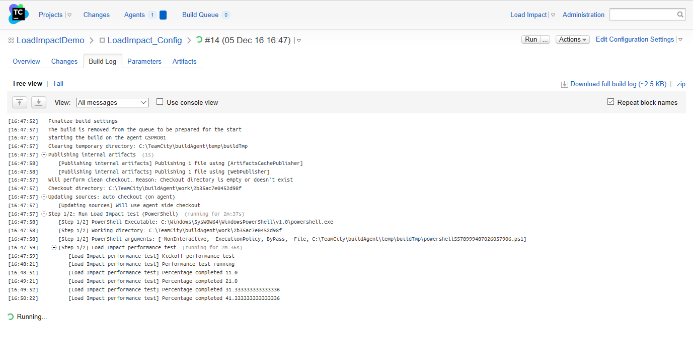
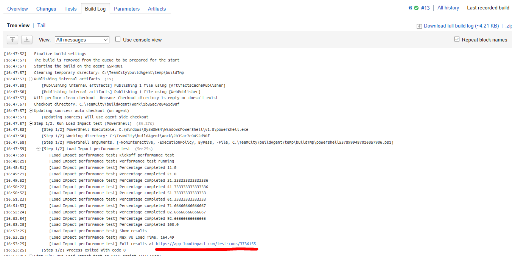
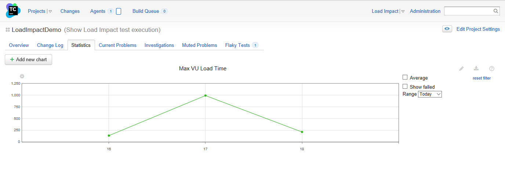

Automated Performance Testing with TeamCity
===========================================

**TeamCity**

Load Impact integrates nicely with TeamCity, continuous integration and delivery server from JetBrains. Using our robust and extensible APIs you can integrate Load Impact’s world-leading performance testing platform into your automated TeamCity build and test process.

Load Impact covers your back with everything you need for Web, API and application performance testing. And test scripting is simple.

To get started, try this sample of how to include performance testing in your TeamCity build setup.

Continuous Delivery. Continuous performance feedback. Simple.
-------------------------------------------------------------

This sample assumes you are familiar with [TeamCity](https://www.jetbrains.com/teamcity/). We set up a new project with a simple build containing one step to run the Load Impact performance test.

Is also assumes you have a Load Impact account. [If not, go get one – it’s free](http://loadimpact.com).

Set up your TeamCity project
============================

We created a TeamCity project by the name LoadImpactDemo which has one build configuration, LoadImpact\_Config.



And here is the history when we have executed a couple of times.



So slightly more interesting – let’s take a look at the settings of the Load Impact configuration.



Everything is plain default, no specific settings needed to run a Load Impact performance test.

We set up two build steps for this configuration, both do the same thing. Assuming you are running a TeamCity build agent on Windows you can run a PowerShell script to execute Load Impact Performance tests as part of your build.

The other build step runs a Bash script as the build step using the built in SSH Exec runner.

Both use [TeamCity Service Messages](https://confluence.jetbrains.com/display/TCD10/Build+Script+Interaction+with+TeamCity#BuildScriptInteractionwithTeamCity-ReportingTests) to communicate status and result to TeamCity.


The Build Step in TeamCity is a *PowerShell Runner*. Just name it whatever you like, we named it “Run Load Impact test”.

PowerShell run mode doesn’t matter and bitness doesn’t matter either, just leave the defaults. But don’t try to run with PowerShell &lt; v4, some things used (Invoke-Webrequest) are not available until v4..The current version at the time of writing is v5.1 so as long as you are recently updated you should be fine.

Select “source code” for your script and paste it all in the script source box. You could of course treat the script itself as an artifact in your build and stick it in your favorite version control system but that is outside the scope of this sample.

For this sample we have opted for script execution mode of “Execute .ps1 from external file”. Just make sure your build Agent is authorized to execute PowerShell.

The details are all in the PowerShell script for the execution so we will take a look at what it does in some detail.

You can get the code at github in the [loadimpact/teamcityloadimpact](https://github.com/loadimpact/teamcityloadimpact) repo where it is shared.

Integrate with the Load Impact API
==================================

Before we dive into the details – let’s get some essentials from your Load Impact account. We need the API key so you can access the API and a test to run.

The API key you get in your Load Impact account when you are logged in


Go to “Monitoring” on the left and click “Use REST API”.

Then copy it from the yellow text box.


Just note that the API token is *longer* than the size of the box so make sure you get all of it!

Now you need to know which test to run. You can list your test configurations using the API or the CLI if you want to but the simplest way is to open it directly in your account and copy the id from the URL. Underlined in red.


So now you have a test id for the test you want to run in your build pipeline and your API key.

All of the code is shared at Github for your download in the [loadimpact/teamcityloadimpact](https://github.com/loadimpact/jenkinsloadimpact) repo!

3a Edit the script to set the test Id and the API key
=====================================================

The code has four parts, the initial and then three stages “Kickoff performance test”, “Performance test running” and “Show results”. If you are familiar with TeamCity you know the output from the execution is visible in the build log when you execute your build including the Load Impact performance test.

The initial part of the PowerShell code is where you set the test id and the API key.

```PowerShell
<# Load Impact test id #>
$testId = YOUR_TEST_ID_HERE
<# API_KEY from your Load Impact account #>
$API_KEY = "YOUR_API_KEY_HERE" + ":"

$auth = 'Basic ' + [System.Convert]::ToBase64String([System.Text.Encoding]::UTF8.GetBytes($API_KEY))
```

So replace “YOUR\_TEST\_ID\_HERE” with your test id, just the number – not a string.

And replace “YOUR\_API\_KEY\_HERE” with your API key. Keep inside the quotes (it is a string) and remember to keep the ‘**:**’ added at the end. It is basic AUTH, the username is the API key with a blank password and that is why we base 64 encode the authorization for later use.

3b Kick off a performance test
==============================

```PowerShell
$uri = "https://api.loadimpact.com/v2/test-configs/" + $testId + "/start"

Write-Host "##teamcity[testStarted name='Load Impact performance test']"
Write-Host "##teamcity[progressMessage 'Kickoff performance test']"

<# try-catch because PS considers all 400+ codes to be errors and will exit if returned #>
$resp = $null
try {
  $resp = Invoke-WebRequest -uri $uri -Method Post -Headers @{'Authorization'=$auth}
} catch {}

<# Status 201 expected, 200 is just a current running test id #>

if ($resp.StatusCode -ne 201) {
  $perc = "Could not start test " + $testId + ": " + $resp.StatusCode + "`n" + $resp.Content
  Write-Host "##teamcity[buildProblem description='$perc']" 
  return
}

$js = ConvertFrom-Json -InputObject $resp.Content

$tid = $js.id

<# Until 5 minutes timout or status is running   #> 

$t = 0
$uri = "https://api.loadimpact.com/v2/tests/" + $tid + "/"
do {
  Start-Sleep -Seconds 10
  $resp = Invoke-WebRequest -uri $uri -Method Get -Headers @{'Authorization'=$auth}
  $j = ConvertFrom-Json -InputObject $resp.Content
  $status_text = $j.status_text
  $t = $t + 10

  if ($t -gt 300) {
    Write-Host "##teamcity[buildProblem description='Timeout - test start > 5 min']" 
    return
  }
} until ($status_text -eq "Running")

Write-Host "##teamcity[progressMessage 'Performance test running']"
```

We kick off the performance test by gluing together the URI for the [API to start the test](http://developers.loadimpact.com/api/#post-test-configs-id-start) and then send service messages to TeamCity on the status of the test.

In PowerShell Invoke-Webrequest will fail if the response code is not &lt; 400 which is not really what we want so we try-catch all possible response codes and then specifically check for the expected 201.

If not there we will send a service message to TeamCity about a build problem including an error text and exit the script. The service message will fail the build step in TeamCity.

If it is good, we parse the json response and extract the running test id.

Then we let it take a maximum of five minutes for the test to actually kickoff. Since it can take Load Impact a couple of minutes to acquire and allocate all the resources (mainly load agents) needed we take some time to let the test reach the status of “Running”. The bigger the test, the more resources needed and the longer it can take. But remember, it’s a couple of minutes.

We get that status of the test by [calling the API](http://developers.loadimpact.com/api/#get-tests-id) and parsing the json response to check for the status in the response.

The last thing we do is to send a service message to TeamCity that the test is running.

3c The test is running
======================

```PowerShell
<# wait until completed #>

$maxVULoadTime = 0.0
$percentage = 0.0
$uri = "https://api.loadimpact.com/v2/tests/" + $tid + "/results?ids=__li_progress_percent_total"
$uril = "https://api.loadimpact.com/v2/tests/" + $tid + "/results?ids=__li_user_load_time"
do {
  Start-Sleep -Seconds 30

  <# Get percent completed #>
  $resp = Invoke-WebRequest -uri $uri -Method Get -Headers @{'Authorization'=$auth}
  $j = ConvertFrom-Json -InputObject $resp.Content

  <# Since -Last 1 will get TWO on occassion we sort and get the first which will always get 1 #>
  $percentage = ($j.__li_progress_percent_total | Sort value -Descending | Select-Object -First 1).value

  Write-Host "##teamcity[progressMessage 'Percentage completed $percentage']"

  <# Get VU Load Time #>
  $resp = Invoke-WebRequest -uri $uril -Method Get -Headers @{'Authorization'=$auth}
  $j = ConvertFrom-Json -InputObject $resp.Content

  <# Sort and get the highest value #>
  $maxVULoadTime = ($j.__li_user_load_time | Sort value -Descending | Select-Object -First 1).value

  if ($maxVULoadTime -gt 1000) {
    $perc = "VU Load Time exceeded limit of 1 sec: " + $maxVULoadTime
    Write-Host "##teamcity[buildStatisticValue key='maxVULoadTime' value='$maxVULoadTime']"
    Write-Host "##teamcity[buildProblem description='$perc']"
    return
  }

} until ([double]$percentage -eq 100.0)
```

So now your Load Impact performance test is running!

This time we wait until the test has completed, reached the percentage completed value of 100% with a slightly longer sleep between refreshing status calls.

We do this by calling the [API for results](http://developers.loadimpact.com/api/#get-tests-id-results) and only requesting the percentage completed. The API returns all of the relevant data so we do some json parsing and just get the last percentage value from the result set.

All the results are available from the API so you can either use them or calculate new aggregate results to use as test thresholds for your pipeline test results.

We included an example of making a threshold from the [VU Load Time (please read the explanation of this value before using it)](http://support.loadimpact.com/knowledgebase/articles/174121-how-do-i-interpret-test-results).

We get the value by calling the same API as before but for the VU Load Time result, parse the json and get the max value by some PowerShell magic sorting and selecting.

If the value exceeds 1 second we exit the build step and fail the build by sending a service message to TeamCity.

3d Show the results
===================

```PowerShell
<# show results #>
Write-Host "##teamcity[progressMessage 'Show results']"
Write-Host "##teamcity[buildStatisticValue key='maxVULoadTime' value='$maxVULoadTime']"
"Max VU Load Time: " + $maxVULoadTime
"Full results at https://app.loadimpact.com/test-runs/" + $tid
```

Finally, we show the results and output the max VU Load Time. It can of course be any result but as a sample. We report the max VU load time as a custom statistics value as well to TeamCity so we can make a snazzy custom graph out of it as well. Once you have executed the build once it will show up in the list of available values to [make a custom graph from](https://confluence.jetbrains.com/display/TCD10/Custom+Chart).

You can use this result to decide on further actions in your build as well but that is outside the scope of this sample. And of course we tack on a direct link to the full results and analysis in Load Impact.

Finally, executing the build in TeamCity.
=========================================



Once started it will look something like the above. Not the status is the one we set in the service message from the script.



Once the test is actually running the message will change to the percentage completed.



And looking into the details of the build log itself we see the steps and the individual service messages.

Finally, once done – Show results.


If you expand to see the details of the build log



there’s also a direct link to the full results and analysis in Load Impact where you can always find all the results of all your tests.

The added bonus: here is what the custom graph can look like in TeamCity.



You can add/update/delete tests, user scenarios and data stores using the API and CLI, even stick all of it in your SCM of choice and let all of it be part of your build pipeline.

To dive deeper into using Load Impact from your CI/CD process (or for that matter any external usage) see our [*comprehensive API reference*](http://developers.loadimpact.com/api/) and the accompanying [*CLI*](http://support.loadimpact.com/knowledgebase/articles/833856-automating-load-testing-with-the-load-impact-api).
